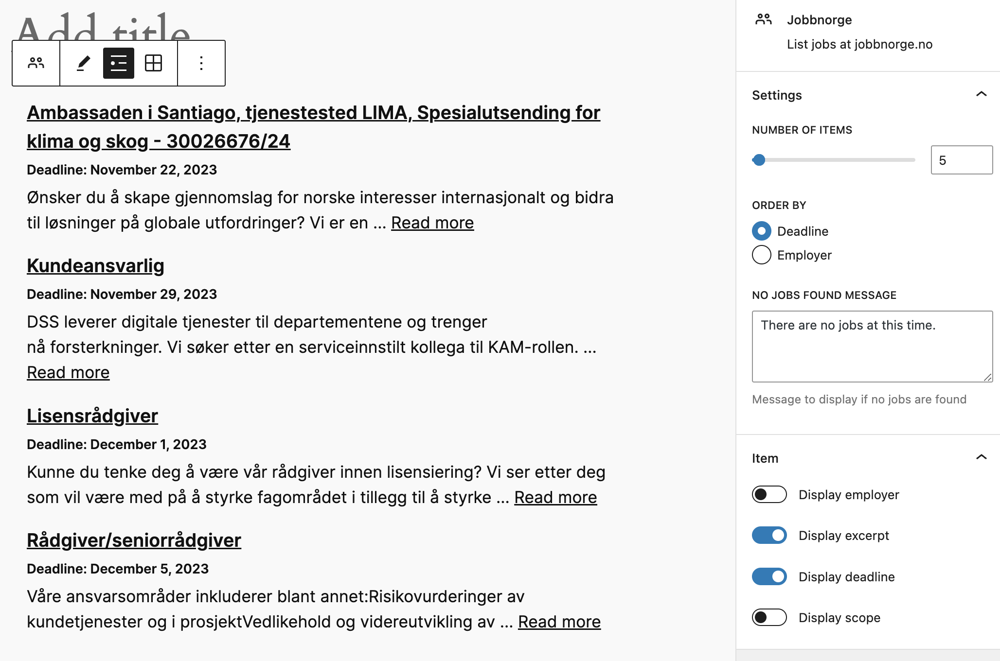

# WP Jobbnorge Block

This WordPress plugin adds a block to the Gutenberg editor that displays a list of jobs from Jobbnorge.


## Featueres

-   Sort jobs bye deadline, closest first.
-   Does not show jobs that are past the deadline.
-   Set the number of jobs to display.
-   Set the number of words in the excerpt.
-   Set the no jobs message.
-   Show or hide the job excerpt.
-   Show or hide the job deadline.
-   Show or hide the job scope.
-   Show or hide the job duration.
-   Display the jobs in a grid or list view.
-   Set the number of columns in the grid view.

## Installation

1. Clone the repository into the `wp-content/plugins` directory
1. Activate the plugin through the 'Plugins' screen in WordPress
1. Use the Gutenberg editor to add the block to a page or post.

## Use

You'll find the block in the "widget" category, look for "Jobbnorge".

### 1) Add the Jobbnorge URL.

The URL should be the RSS feed for the job list. The URL should look like this, replace 123456789 with your id: `https://www.jobbnorge.no/apps/joblist/JobListBuilder.ashx?id=123456789&trid=1`

[](.wordpress-org/screenshot-1.png)

### 2) Modify the block settings.

-   Set the number of jobs to display.
-   Set the number of words in the excerpt.
-   Set the no jobs message.
-   Show or hide the job excerpt.
-   Show or hide the job deadline.
-   Show or hide the job scope.
-   Show or hide the job duration.

[](.wordpress-org/screenshot-2.png)

### 3 optional), Grid view.

-   Set the number of columns in the grid view.

[](.wordpress-org/screenshot-3.png)

## Styling

The block html look like this, and uses the following classes for styling:

```html
<ul
	class="wp-block-dss-jobbnorge is-grid columns-N has-excerpts has-deadline has-scope has-duration"
>
	<li class="wp-block-dss-jobbnorge__item">
		<div class="wp-block-dss-jobbnorge__item-title">
			<a href="URL">Title</a>
		</div>
		<div class="wp-block-dss-jobbnorge__item-meta">
			<time datetime="" class="wp-block-dss-jobbnorge__item-deadline">
				Date
			</time>
			<div class="wp-block-dss-jobbnorge__item-scope">Scope</div>
			<div class="wp-block-dss-jobbnorge__item-duration">Duration</div>
		</div>
		<div class="wp-block-dss-jobbnorge__item-excerpt">
			Excerpt
			<a href="URL">Read More</a>
		</div>
	</li>
</ul>
```

`is-grid`, `columns-N` (N = 2-6), `has-excerpts`, `has-deadline`, `has-scope` and `has-duration` are added to the `<ul>` element depending on the block settings.

Default styling is provided by the [`style.scss`](src/style.scss) file.

## Credits

-   The Jobbnorge Block is an extension of the [Gutenberg core/rss block](https://github.com/WordPress/gutenberg/tree/trunk/packages/block-library/src/rss)

## Copyright and license

WP Jobbnorge Block is copyright 2023 Per Søderlind

WP Jobbnorge Block is free software: you can redistribute it and/or modify it under the terms of the GNU General Public License as published by the Free Software Foundation, either version 2 of the License, or (at your option) any later version.

WP Jobbnorge Block is distributed in the hope that it will be useful, but WITHOUT ANY WARRANTY; without even the implied warranty of MERCHANTABILITY or FITNESS FOR A PARTICULAR PURPOSE. See the GNU General Public License for more details.

You should have received a copy of the GNU Lesser General Public License along with the Extension. If not, see http://www.gnu.org/licenses/.
